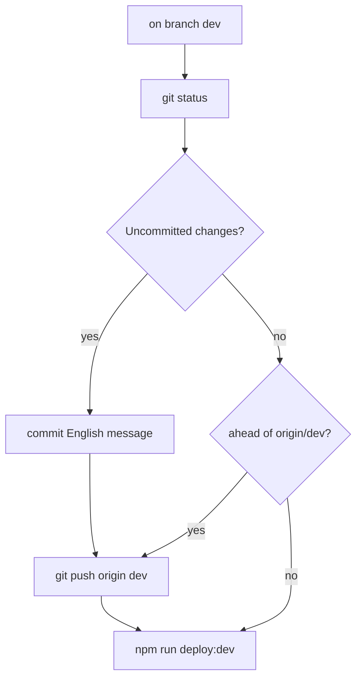

Deploy the Akademiata theme to **dev** — git branch **`dev`**, then SFTP upload.

The user invoked `/deploy-dev` — **commit, push, and deploy** are allowed when this command runs. **Never commit** `deploy.local.env`.

## Branches

| Branch | Use |
|--------|-----|
| **`dev`** | Day-to-day work; **`/deploy-dev`** commits and pushes here, then SFTP to dev.akademiata.pl |
| **`main`** | Production-ready; use **`/pr`** (commit + push `main`), not deploy-dev |

If the user is on **`main`** with uncommitted work intended for dev: `git checkout dev` (create/switch), then commit there — or merge/cherry-pick as appropriate. Do not push theme work to `main` via `/deploy-dev`.

## Default flow (commit if needed → push `dev` → deploy)



### 1. Branch and inspect

```bash
git checkout dev
```

If `dev` does not exist locally: `git checkout -b dev` and ensure it tracks `origin/dev` after first push.

Parallel:

- `git status`
- `git diff` (staged and unstaged)
- `git log -3 --oneline`

### 2. Commit — only if working tree is dirty

Skip when **clean**.

**Before staging**

- Do **not** stage `deploy.local.env`, `.env`, keys, or credentials.
- Fix broken Polish mojibake in PHP before commit.
- Stage only files that belong to the change.

**Commit rules** (same as `/pr`)

- Commit messages: **English only**, 1–2 sentences, focus on **why**.
- Never `git commit --amend` unless the user asked and HEAD is unpushed on `dev`.
- If a hook fails: fix and make a **new** commit.

```bash
git add <relevant paths>
git commit -m "..."
```

### 3. Push — if needed

```bash
git push -u origin dev
```

Skip when already up to date with `origin/dev`.

Remote: **`origin`** → https://github.com/irynaBilousSPDev/deAtaCennik.git

### 4. Deploy to dev (SFTP)

**Prerequisites:** `deploy.local.env` filled. `npm install` done once.

```bash
npm run deploy:dev
```

- Runs `npm run build` unless `SKIP_BUILD=true` in `deploy.local.env`.
- Uploads to `wp-content/themes/akademiata` on dev (relative to SFTP WordPress root).
- **Dry run:** `DRY_RUN=true` in `deploy.local.env`.

**Tracking on dev:** `header.php` loads GTM / gtag only when `akademiata_is_production()` (akademiata.pl). Cookiebot is plugin-only. Dev must not output GTM/gtag in page source.

## Deploy only (no commit, no push)

User says **deploy only** / **without commit** / **skip git**:

- Ensure on **`dev`** (warn if on `main` with dirty tree).
- Run **only** `npm run deploy:dev`.

## After deploy

- [ ] https://dev.akademiata.pl/ — view source: no GTM / gtag (Cookiebot from plugin is OK)
- [ ] Changed page/section works
- [ ] `npm run build` if `assets/src/` changed

## Do not

- Commit or push `deploy.local.env`.
- Push `/deploy-dev` work to `main`.
- Deploy to production unless explicitly asked.
- Force-push `dev` or `main`.
