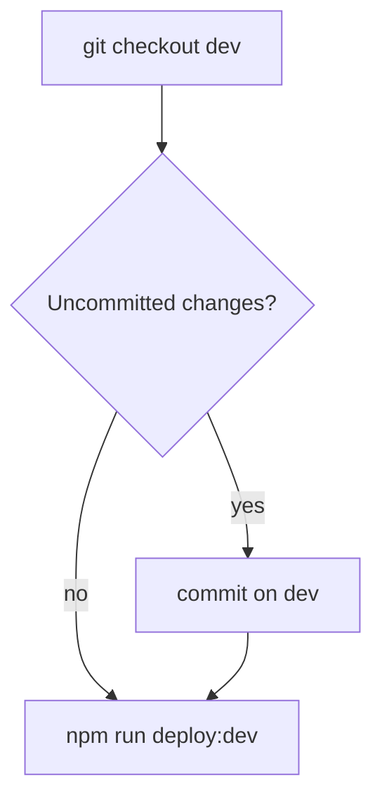

Deploy the Akademiata theme to **dev** (fast) — branch **`dev`**, local commit optional, **no git push**, then SFTP.

The user invoked `/deploy-dev` — **commit** and **deploy** are allowed. **Do not push** unless the user says **push dev**. **Never commit** `deploy.local.env`.

## Branches

| Branch | Use |
|--------|-----|
| **`dev`** | Day-to-day work + `/deploy-dev` (SFTP to dev.akademiata.pl) |
| **`main`** | Production; updated via **`/deploy-prod`** or **`/pr`** |

## Default flow (commit if needed → SFTP only)



**No `git push`** in the default flow — saves time. GitHub `origin/dev` is updated only when the user says **push dev** (see below).

### 1. Branch and inspect

```bash
git checkout dev
```

Parallel: `git status`, `git diff`, `git log -3 --oneline`

### 2. Commit — only if dirty

Skip when clean. Do not stage `deploy.local.env`. Commit messages: **English only**.

### 3. Deploy (SFTP)

```bash
npm run deploy:dev
```

Uploads to `wp-content/themes/akademiata` on dev. `SKIP_BUILD=true` / `DRY_RUN=true` in `deploy.local.env` when needed.

## Push dev to GitHub (optional)

Only when the user says **push dev**, **sync github**, or **push origin dev**:

```bash
git push origin dev
```

## Skip git entirely

**Deploy only** / **without commit**: run only `npm run deploy:dev` on branch `dev`.

## Production

Use **`/deploy-prod`**: merge `dev` → `main`, push `main`, SFTP to production — not this command.

## Do not

- Push to `main` from `/deploy-dev`.
- Commit `deploy.local.env`.
- Deploy production unless explicitly asked.
