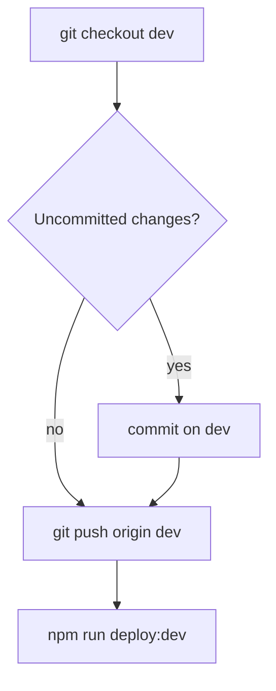

Deploy the Akademiata theme to **dev** — branch **`dev`**: commit → **push GitHub** → SFTP dev.

The user invoked `/deploy-dev` — **commit**, **push**, and **deploy** are allowed. **Never commit** `deploy.local.env`.

**GitHub is the source of truth** between PCs. Push **before** SFTP so the other laptop can `/sync-git` and get the same code.

For **download only** (no server upload): use **`/sync-git`** / `npm run sync:git` — not this command.

## Branches

| Branch | Use |
|--------|-----|
| **`dev`** | Day-to-day work + `/deploy-dev` (push + SFTP to dev.akademiata.pl) |
| **`main`** | Production; updated via **`/deploy-prod`** or **`/pr`** |

## Flow (commit → push → SFTP)



### 1. Branch and inspect

```bash
git checkout dev
```

Parallel: `git status`, `git diff`, `git log -3 --oneline`

### 2. Commit — only if dirty

Skip when clean. Do not stage `deploy.local.env`. Commit messages: **English only**.

### 3. Push `dev` to GitHub (before SFTP)

```bash
git push origin dev
```

So home/work PC can `npm run sync:git` and get identical files.

### 4. Deploy (SFTP)

```bash
npm run deploy:dev
```

Uploads **only git-changed files** (last commit / `origin/dev..HEAD`) to `wp-content/themes/akademiata` on dev.

`DEPLOY_FULL=true` — compare entire theme with server (rare; server drift). `SKIP_BUILD=true` / `DRY_RUN=true` in `deploy.local.env` when needed.

## Skip git entirely

**Deploy only** / **without commit**: run only `npm run deploy:dev` on branch `dev` (no push unless user asks).

## Push only (no SFTP)

Use **`/push-dev`** when you only need GitHub backup without uploading to dev.

## Production

Use **`/deploy-prod`**: merge `dev` → `main`, push **`main` + `dev`**, SFTP to production — not this command.

## Do not

- Push to `main` from `/deploy-dev`.
- Commit `deploy.local.env`.
- Deploy production unless explicitly asked.
