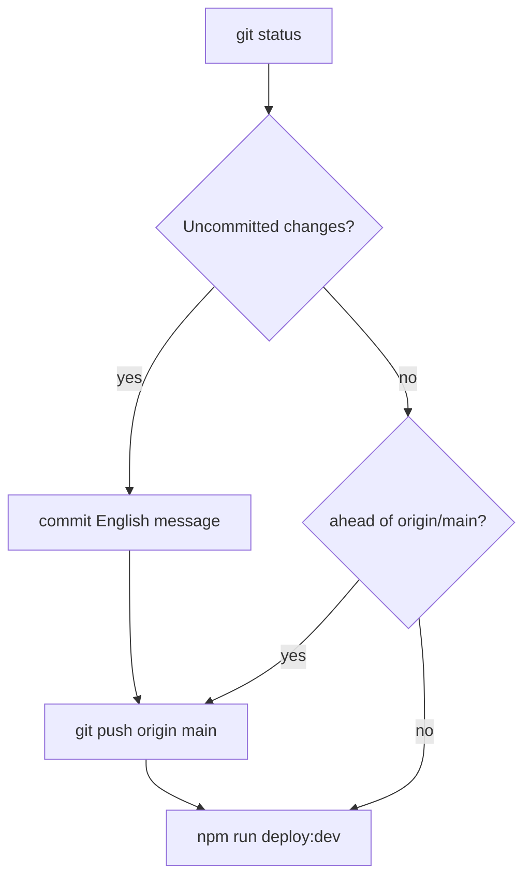

Deploy the Akademiata theme to **dev** — sync git with GitHub, then SFTP upload.

The user invoked `/deploy-dev` — **commit, push, and deploy** are allowed when this command runs. **Never commit** `deploy.local.env`.

## Default flow (commit if needed → push → deploy)



### 1. Inspect git (parallel)

- `git status`
- `git diff` (staged and unstaged)
- `git log -3 --oneline`

### 2. Commit — only if working tree is dirty

Skip this block when the working tree is **clean** (nothing to commit).

**Before staging**

- Do **not** stage `deploy.local.env`, `.env`, keys, or credentials.
- Fix broken Polish mojibake in PHP before commit.
- Stage only files that belong to the change.

**Commit rules** (same as `/pr`)

- Commit messages: **English only**, 1–2 sentences, focus on **why**.
- Never `git commit --amend` unless the user asked and HEAD is unpushed.
- If a hook fails: fix and make a **new** commit.

```bash
git add <relevant paths>
git commit -m "..."
```

### 3. Push — if needed

Push when there are **unpushed commits** (just committed, or already committed locally):

```bash
git push origin main
```

Skip push when already up to date with `origin/main`.

Remote: **`origin`** → https://github.com/irynaBilousSPDev/deAtaCennik.git (`ata2026` only if the user asked).

### 4. Deploy to dev (SFTP)

**Prerequisites:** `deploy.local.env` filled (not `your_sftp_username`). `npm install` done once.

```bash
npm run deploy:dev
```

- Runs `npm run build` unless `SKIP_BUILD=true` in `deploy.local.env`.
- Uploads changed theme files to `SFTP_REMOTE_PATH` (default `/wp-content/themes/akademiata`).
- **Dry run:** `DRY_RUN=true` in `deploy.local.env` — list only, no upload.

**SFTP failures:** wrong host/port, auth, or remote path — fix `deploy.local.env`; never print passwords in chat.

## Deploy only (no commit, no push)

Use when the user says **deploy only**, **without commit**, or **skip git**:

- Run **only** step 4 (`npm run deploy:dev`).
- If the tree is dirty, **warn** that dev will not match `origin/main` until they commit or run full `/deploy-dev`.

## After deploy

- [ ] https://dev.akademiata.pl/
- [ ] Changed page/section (offer, header, calculator if relevant)
- [ ] `npm run build` ran if `assets/src/` changed (unless `SKIP_BUILD=true`)

## Do not

- Commit or push `deploy.local.env`.
- Deploy to production unless explicitly asked.
- Force-push `main`.
