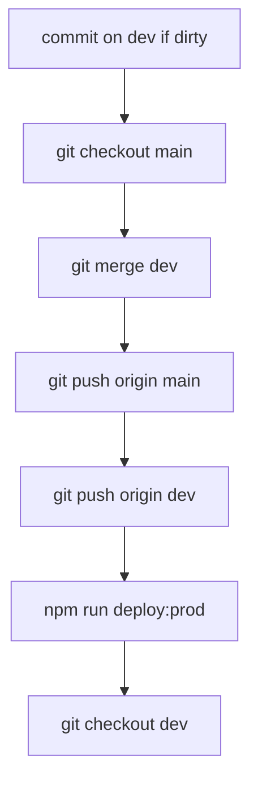

Deploy the Akademiata theme to **production** — `dev` → `main` → GitHub → SFTP prod.

The user invoked `/deploy-prod` — **merge, push, and deploy** are allowed. **Never commit** `deploy.local.env`.

## Flow



### 1. Finish work on `dev`

```bash
git checkout dev
```

- `git status` / `git diff`
- If dirty: commit (English message), do **not** stage `deploy.local.env`

### 2. Merge into `main`

```bash
git checkout main
git pull origin main
git merge dev -m "Merge branch 'dev' into main for production deploy."
```

If merge conflicts: stop and report; do not force-push.

### 3. Push `main`

```bash
git push origin main
git push origin dev
```

Remote: **`origin`** → https://github.com/irynaBilousSPDev/deAtaCennik.git

After merge, **`dev` and `main` point to the same commit** — push both so GitHub stays in sync.

### 4. SFTP to production

**Prerequisites:** `deploy.local.env` has `SFTP_PROD_HOST`, `SFTP_PROD_USER`, `SFTP_PROD_PASSWORD` (or `SFTP_PROD_PRIVATE_KEY`), `SFTP_PROD_REMOTE_PATH`.

```bash
npm run deploy:prod
```

- Builds assets unless `SKIP_BUILD=true`
- Uploads theme to production `wp-content/themes/akademiata`
- **GTM / gtag** load on prod (`akademiata_is_production()`). Cookiebot = plugin only.

### 5. Return to `dev`

```bash
git checkout dev
```

## After deploy

- [ ] https://akademiata.pl/ (or www) — key pages, calculator, offers
- [ ] View source: GTM/gtag present on prod; no duplicate Cookiebot script in theme
- [ ] Dev site unchanged unless you also ran `/deploy-dev`

## Do not

- Force-push `main` or `dev`.
- Commit credentials.
- Run prod SFTP without confirming `SFTP_PROD_*` in `deploy.local.env`.
