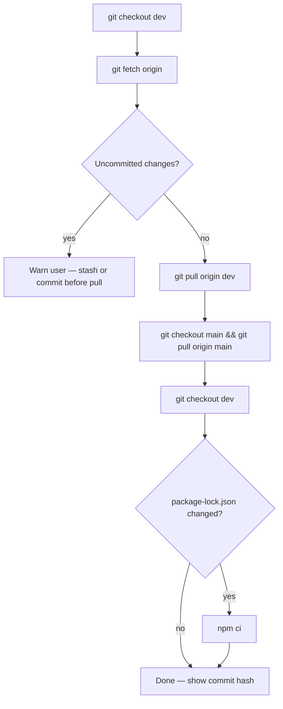

Sync **local PC from GitHub** — **no SFTP**, no deploy.

Use when the user says: *download from git*, *sync from git*, *pull latest*, *worked at home yesterday*, *update local from remote*, *ściągnij z gita*.

**GitHub (`origin/dev`) is the source of truth** between home PC, work PC, and what should be on the server after `/deploy-dev`.

## Do not

- Run `npm run deploy:dev` or `/deploy-dev` (that uploads to the server — different goal).
- Commit unless the user explicitly asks to save local uncommitted work.

## Flow



### Commands

```bash
git checkout dev
git fetch origin
git status
git pull origin dev
git checkout main
git pull origin main
git checkout dev
```

Or one step:

```bash
npm run sync:git
```

If `package-lock.json` changed after pull:

```bash
npm ci
```

### Report to user

- Current commit on `dev` and `main` (`git log -1 --oneline dev main`)
- Confirm `dev` and `main` match `origin/*` (`git status`)
- Remind: **server (dev.akademiata.pl) is updated only by `/deploy-dev`**, not by pull.

## Daily workflow (two PCs)

| At end of session (home or work) | Start of session on other PC |
|----------------------------------|------------------------------|
| `/deploy-dev` → commit + **push** + upload changed files to dev | `/sync-git` → `npm run sync:git` |
| Or `/push-dev` if no deploy yet | `npm ci` if lockfile changed |

**Rule:** never deploy uncommitted work. Everything on the server should exist in git on `dev` first.
