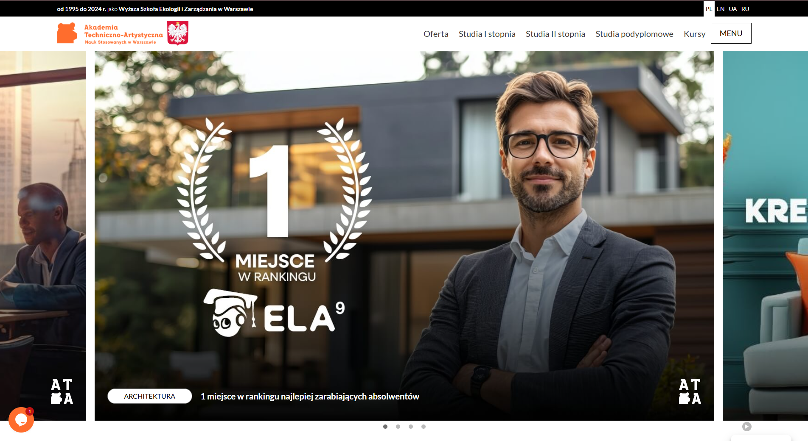

# Akademiata

**Akademiata** is a custom WordPress theme developed by Avista Consulting & Management.

- **Contributors**: Avista Consulting & Management
- **Author**: Avista Consulting & Management
- **Author URI**: `https://avistacm.com/`
- **Tags**: custom, responsive, modern, slick-slider, sass, gulp, webpack
- **License**: GNU General Public License v2 or later
- **License URI**: `https://www.gnu.org/licenses/gpl-2.0.html`



## Requirements

- [Node.js](https://nodejs.org/)
- npm (comes with Node.js)

## Local development

Run in the theme directory (inside `wp-content/themes/akademiata`):

```bash
npm install
```

- **Dev/watch (recommended)**:

```bash
npm run dev
```

- **Build (production)**:

```bash
npm run build
```

- **Gulp only**:

```bash
npm run start
```

## Cleaning dependencies

- **Cross-platform (recommended)**:

```bash
npm run remove
```

- **PowerShell manual**:

```powershell
Remove-Item -Recurse -Force node_modules
Remove-Item package-lock.json
```

## Prices calculator (key files)

The “Prices” page template and calculator live here:

- **Template**: `page-template-prices.php`
- **Calculator JS (source)**: `assets/src/js/prices-calculator.js`
- **Styles (source)**: `assets/src/scss/pages/_prices-page.scss`
- **Local JSON data**: `prices.json`

Important: if your site serves compiled assets, make sure you run `npm run build` (or `npm run dev`) after editing `assets/src/*`.

## Apps Script backup (pricing JSON web app)

Full script + step-by-step setup (new Google account, deploy, WordPress URL):

- **`apps-script/README.md`** — start here
- **`apps-script/prices-json-webapp.gs`** — copy entire file into Google Apps Script

Quick test URL after deploy: `https://script.google.com/macros/s/YOUR_ID/exec?force=1`

## Deploy to dev (SFTP)

1. Copy `deploy.local.env.example` → `deploy.local.env` (gitignored).
2. Fill SFTP host, user, remote path `wp-content/themes/akademiata` (relative to SFTP root — usually the WordPress root), and SSH key or password.
3. `npm install`
4. `npm run deploy:dev` — builds assets, uploads changed theme files.

**Git:** branch **`dev`** for dev work; **`main`** for production (**`/pr`**). **Cursor:** **`/deploy-dev`** — commit on `dev` (if needed) → push `origin dev` → SFTP. Say **deploy only** to skip git.

**Analytics:** GTM and gtag load only on production (`akademiata_is_production()`). Cookiebot is handled by the WordPress plugin, not the theme.

**Dry run:** set `DRY_RUN=true` in `deploy.local.env`. **Skip build:** `SKIP_BUILD=true`.

## Deployment notes (PhpStorm)

- Configure **FTP/SFTP**
- Configure **Mappings**
- Configure **Excluded paths**
- Upload theme to server (or use `npm run deploy:dev` above)

## License & credits

Akademiata is licensed under the **GNU General Public License v2 or later**.

**Third-party libraries:**

- [Slick Slider](https://kenwheeler.github.io/slick/) (MIT)
- [Bootstrap](https://getbootstrap.com/) (MIT)

For full details, see `LICENSE.txt`.
