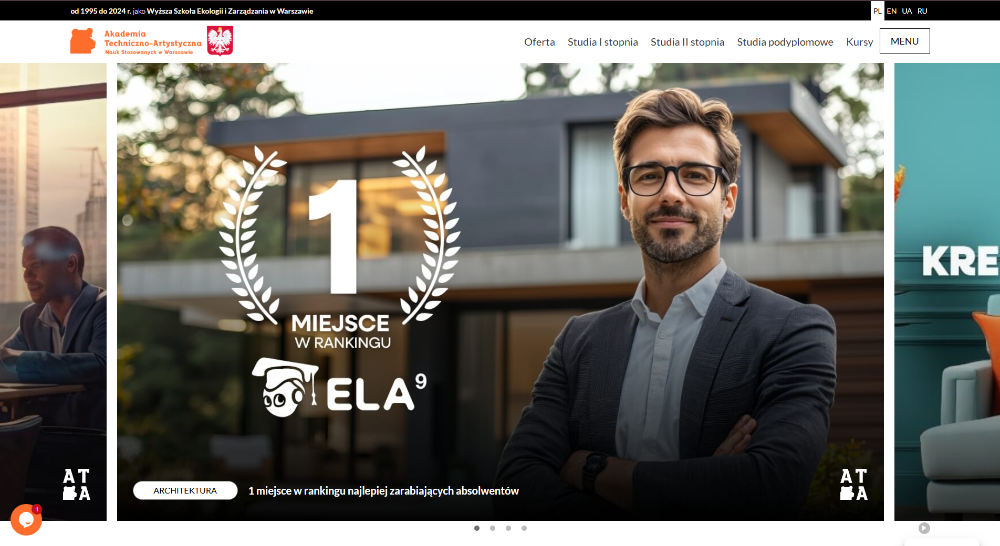

# Akademiata

**Akademiata** is a custom WordPress theme developed by Avista Consulting & Management.

- **Contributors**: Avista Consulting & Management
- **Author**: Avista Consulting & Management
- **Author URI**: `https://avistacm.com/`
- **Tags**: custom, responsive, modern, slick-slider, sass, gulp, webpack
- **License**: GNU General Public License v2 or later
- **License URI**: `https://www.gnu.org/licenses/gpl-2.0.html`



## Requirements

- [Node.js](https://nodejs.org/)
- npm (comes with Node.js)

## Local development

Run in the theme directory (inside `wp-content/themes/akademiata`):

```bash
npm install
```

- **Dev/watch (recommended)**:

```bash
npm run dev
```

- **Build (production)**:

```bash
npm run build
```

- **Gulp only**:

```bash
npm run start
```

## Cleaning dependencies

- **Cross-platform (recommended)**:

```bash
npm run remove
```

- **PowerShell manual**:

```powershell
Remove-Item -Recurse -Force node_modules
Remove-Item package-lock.json
```

## Prices calculator (key files)

The “Prices” page template and calculator live here:

- **Template**: `page-template-prices.php`
- **Calculator JS (source)**: `assets/src/js/prices-calculator.js`
- **Styles (source)**: `assets/src/scss/pages/_prices-page.scss`
- **Local JSON data**: `prices.json`

Important: if your site serves compiled assets, make sure you run `npm run build` (or `npm run dev`) after editing `assets/src/*`.

## JSON-LD schema (theme)

Structured data for search engines and AI crawlers is generated **by the theme** in `configure/schema/` (loaded from `configure/schema.php`). Output is a single `<script type="application/ld+json">` block in `wp_head` per view — **no SASWP / manual schema plugins**, Yoast schema output disabled on prod.

**Goal:** mirror what visitors see on the page (sections, prices, promos, recruitment, FAQ) so bots do not rely on guessing from HTML alone.

### Architecture

| Layer | File(s) | `wp_head` priority |
|-------|---------|-------------------|
| Site dispatcher | `site-schema.php` | 19 |
| Homepage graph | `homepage-schema.php` + `homepage-schema-helpers.php` | 19 |
| WordPress pages | `page-schema.php`, `page-special-schema.php`, `lp-schema-helpers.php` | 19 |
| News | `news-schema.php` | 19 |
| Archives / search | `archive-schema.php` | 19 |
| Offer singles | `bachelor-schema.php`, `master-schema.php`, `postgraduate-schema.php`, `mba-schema.php`, `degree-program-schema*.php`, `pg-mba-schema-helpers.php` | 20 |
| Courses / exams | `courses-schema.php`, `exams-schema.php` | 20 |
| Shared helpers | `schema-helpers.php`, `site-schema-helpers.php` | — |

**Dispatcher** (`site-schema.php`): front page → homepage; single `post` → news; aktualności archive → news list; single `page` → page router; else CPT/taxonomy/search archives → `CollectionPage`. Offer CPT singles skip site dispatcher (their own hooks at priority 20).

### What schema each view gets

| View | `@type` | Main content in JSON-LD |
|------|---------|-------------------------|
| **Homepage** | `@graph`: `CollegeOrUniversity` + `WebSite` + `WebPage` | Org contact, `hasOfferCatalog`, hero slider, offer sliders, counters, rankings, promos, news teasers — `subjectOf` from front-page ACF |
| **Bachelor / master** (single) | `EducationalOccupationalProgram` | `subjectOf` (sections, recruitment docs, rankings), `offers` from **`prices.json`**, **PROMOS** from **`prices.json`**, `ApplyAction`, prerequisites, modules |
| **MBA / PG** (single) | `EducationalOccupationalProgram` | `subjectOf` from ACF accordions (program, discounts, recruitment), `offers` from **ACF cennik** (not `prices.json`) |
| **Courses** (single) | `Course` | Description, provider, registration |
| **Exams** (single) | `Event` | Dates, location, organizer |
| **Landing pages** (O Uczelni, Rankingi, Rekrutacja, Katalog… — 9 LP templates) | `WebPage` / `AboutPage` + **`subjectOf`** | Full ACF sections via same `configure/lp-defaults/*/fields.php` merge as the template; FAQ sections also emit `FAQPage` in `@graph` |
| **FAQ page** | `FAQPage` | Q&A from CPT `faq` + `faq_topics` |
| **Contact** | `ContactPage` | Header repeater + contact CPT + Welyo recruitment ContactPoint (call / callback + hours) |
| **Offer listing** (`page-offer.php`) | `CollectionPage` | `ItemList` of bachelor/master URLs (initial query) |
| **Katalog kierunków** | `WebPage` + `ItemList` | LP sections + linked programs |
| **Prices calculator** | `WebPage` | Calculator hint + link to `prices.json` in `subjectOf` |
| **Open Day** | `WebPage` + `Event` | ACF date, schedule, location |
| **Aktualności** (archive) | `CollectionPage` | List of `NewsArticle` URLs |
| **Single news post** | `NewsArticle` | Headline, dates, publisher, city |
| **CPT / taxonomy / search archives** | `CollectionPage` | Archive title + `ItemList` of posts |
| **Default page** | `WebPage` | Title, description, editor content |

Registry and checklist for **new page templates**: `.cursor/rules/akademiata-schema-pages.mdc`.

### Data sources (important)

| Content | Source | Used in schema for |
|---------|--------|-------------------|
| Licencjat / magister — ceny | `prices.json` (theme root) | `offers`, `priceSpecification` |
| Licencjat / magister — promocje | `PROMOS` in **`prices.json`** | `subjectOf` (eligible promos per offer) |
| Kalkulator (front) | Google Apps Script + 15 min transient | **Not** schema — calculator only |
| MBA / PG — ceny i zniżki | ACF on the offer (`payments`, `discounts_accordion`) | `offers`, `subjectOf` |
| Homepage, LP, pages | ACF / `lp-defaults` merge | `subjectOf`, descriptions |
| Optional SEO blurb | ACF **`schema_seo_description`** | Overrides auto `description` when set |
| Recruitment widget (Welyo) | Plugin settings (`phone_*`, `hours_by_day`, texts) | Homepage Organization + Contact page: ContactPoint + subjectOf (call during hours / leave number for callback) |

After uploading a new **`prices.json`**: deploy theme file, then **clear WP Rocket on prod** so offer HTML/JSON-LD refreshes. Schema reads `prices.json` on each request (re-checks file mtime; no WP transient).

Regenerate JSON from Google Sheet: see **`apps-script/README.md`**.

### How updates work (editor workflow)

1. **No theme-side cache** for schema — builders call `get_fields()` / `get_field()` / post content on each request.
2. **Save post or page in WP admin** → JSON-LD reflects new ACF/content on the next **uncached** HTML response.
3. **Dev** (`dev.akademiata.pl`): no page cache plugin — changes visible immediately after save.
4. **Prod** (`akademiata.pl`): WP Rocket caches HTML → **clear cache** (page or whole site) after content or `prices.json` changes.
5. **New page** with an existing template → schema applies automatically (assign template in Page attributes).
6. **New template** → register in `page-schema-helpers.php` + builder; see Cursor rule above.

### AI crawlers

Prod only (`configure/ai-crawler-hints.php`):

- **`/pricing-for-ai.txt`** — plain-text guide (tuition file URL, PROMOS, cache note)
- **`<link rel="alternate">`** to `prices.json` in `head` on relevant views

### Verify on prod

- View source: one theme JSON-LD block; no duplicate Yoast/SASWP program schema.
- Homepage: `@graph` with 3 nodes, rich `subjectOf`.
- Sample offer (bachelor/master): `offers`, PROMOS in `subjectOf`, `ApplyAction`.
- Sample MBA: offers from ACF, discounts in `subjectOf` (not `prices.json` PROMOS).

### Key files (quick index)

```
configure/schema.php              # loader
configure/schema/site-schema.php  # dispatcher
configure/schema/homepage-schema*.php
configure/schema/degree-program-schema*.php  # bachelor/master
configure/schema/pg-mba-schema-helpers.php   # MBA/PG
configure/schema/page-schema.php             # pages router
configure/schema/lp-schema-helpers.php       # LP → subjectOf
configure/schema/page-special-schema.php     # FAQ, contact, offer list…
configure/ai-crawler-hints.php               # /pricing-for-ai.txt
prices.json                                    # bachelor/master prices + PROMOS
```

## Apps Script backup (pricing JSON web app)

Full script + step-by-step setup (new Google account, deploy, WordPress URL):

- **`apps-script/README.md`** — start here
- **`apps-script/prices-json-webapp.gs`** — copy entire file into Google Apps Script

Quick test URL after deploy: `https://script.google.com/macros/s/YOUR_ID/exec?force=1`

## Deploy to dev (SFTP)

1. Copy `deploy.local.env.example` → `deploy.local.env` (gitignored).
2. Fill SFTP host, user, remote path `wp-content/themes/akademiata` (relative to SFTP root — usually the WordPress root), and SSH key or password.
3. `npm install`
4. `npm run deploy:dev` — builds assets, uploads changed theme files.

**Git:** **`dev`** for daily work; **`main`** for production. **`/deploy-dev`** — commit on `dev` (if needed) + SFTP to dev (no GitHub push). **`/push-dev`** or say **push dev** to sync `origin/dev`. **`/deploy-prod`** — merge `dev` → `main`, push `main`, `npm run deploy:prod` (set `SFTP_PROD_*` in `deploy.local.env`).

**Analytics:** GTM/gtag on production only (`akademiata_is_production()`). Cookiebot via WP plugin.

**Dry run:** set `DRY_RUN=true` in `deploy.local.env`. **Skip build:** `SKIP_BUILD=true`.

## Deployment notes (PhpStorm)

- Configure **FTP/SFTP**
- Configure **Mappings**
- Configure **Excluded paths**
- Upload theme to server (or use `npm run deploy:dev` above)

## Admin: post history (CPT)

1. Install **[Simple History](https://wordpress.org/plugins/simple-history/)** on dev and production (Dashboard → Wtyczki).
2. **Ustawienia → Simple History** — leave default loggers on; optional email alerts.
3. View log: **Dashboard → Simple History** or widget on home screen.
4. Theme CPTs include **`revisions`** — when editing an offer, open **Rewizje** in the sidebar to compare older saves.

ACF field-level diffs may appear only as “Post updated” unless you use a Simple History premium add-on.

## License & credits

Akademiata is licensed under the **GNU General Public License v2 or later**.

**Third-party libraries:**

- [Slick Slider](https://kenwheeler.github.io/slick/) (MIT)
- [Bootstrap](https://getbootstrap.com/) (MIT)

For full details, see `LICENSE.txt`.
